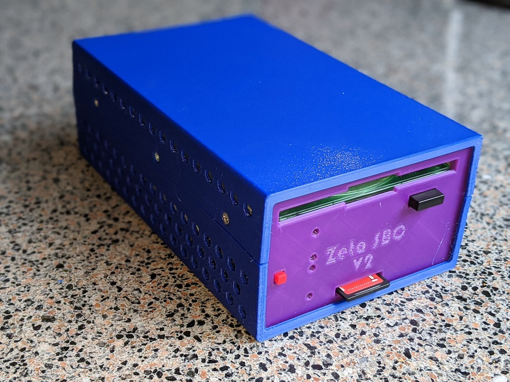

# Zeta SBC
3D Printable Enclosure for Zeta SBC and ParPortProp Based System

## Description
This is a 3D printable enclosure for Zeta SBC. This design is inspired by [OpenSCAD Parametric Box by FB Aka Heartman/Hearty](http://heartygfx.blogspot.com).
I did a complete redesign to support the specific requirements I had for the Zeta SBC based system.

This enclosure fits a Zeta SBC or Zeta SBC V2 SBC with a ParPortProp board mounted under it, and a 3.5" floppy drive mounted on top of it.

I've included two front panel designs: The [first one](Zeta-Front-Floppy_with_Bezel.stl) works with regular floppy drives that
have their own bezel. The [second one](Zeta-Front-Floppy_no_Bezel_Sony.stl) works with the Sony MPF920-L drive without bezel.
It is assumed that for the Reset button Zeta SBC uses a tactile switch with the projected plunger and a 4 x 4 mm key top.
Refer to [Recommended Electronic and Hardware Parts](#recommended-electronic-and-hardware-parts) section below for the part numbers.

The boards and the floppy drive are mounted together using eight 15 mm standoffs.
The board stack is then mounted to the bottom of the enclosure using 4 flat head M3 x 12 mm screws that go into the standoffs.
The top part and the bottom parts are secured together using 4 flat head M3 x 8 mm screws going into threaded mounting holes
on the sides of the floppy drive, and 2 flat head M3 x 6 mm screws and 2 sqare nuts placed into the slots in the bottom part.

## 3D Printed Parts

* [Enclosure Bottom](Zeta-Bottom.stl)
* [Enclosure Back](Zeta-Back.stl)
* [Enclosure Front with Floppy Drive Cutout](Zeta-Front-Floppy_with_Bezel.stl)
* [Enclosure Front for Sony MPF920-L drive without bezel](Zeta-Front-Floppy_no_Bezel_Sony.stl)
* [Enclosure Top](Zeta-Top.stl)
* [OpenSCAD Source Code](CaseGenerator-Zeta.scad)

### 3D Printing Recommendations

Print these parts with the "flat face" down. Use the "Rotate" function in your slicer software to rotate parts accordingly.
The front and the back parts should be printed with the outer side facing the printer bed.
Make sure to clean any 3D printing artifacts prior to assembling the case.
Use a 3.2 mm (1/8") drill bit to clean the M3 holes in the top and bottom parts.

## Recommended Electronic and Hardware Parts

Part Name      | Description                      | Quantity | Part Number
-------------- | -------------------------------- | -------- | ------------------
Tactile Switch | Right Angle, Projected Plunger   | 1        | Mouser [653-B3F-3152](https://www.mouser.com/ProductDetail/653-B3F-3152)
Key Top        | 4 mm x 4 mm, Red                 | 1        | Mouser [653-B32-1080](https://www.mouser.com/ProductDetail/653-B32-1080)
Standoff       | M3 x 15 mm, Hex, OD: 5 mm, Male/Female | 8  | Mouser [534-24315](https://www.mouser.com/ProductDetail/534-24315)
Screw          | M3 x 12 mm, Hex Drive Flat Socket Cap | 4   | Fastenal [M42510012A40000](https://www.fastenal.com/products/details/M42510012A40000)
Screw          | M3 x 8 mm, Hex Drive Flat Socket Cap | 4    | Fastenal [M42510008A40000](https://www.fastenal.com/products/details/M42510008A40000)
Screw          | M3 x 6 mm, Hex Drive Flat Socket Cap | 2    | Fastenal [M42510006A40000](https://www.fastenal.com/products/details/M42510006A40000)
Nut            | M3 x 1.8 mm, Square Nut          | 2        | Fastenal [0161907](https://www.fastenal.com/products/details/0161907)
